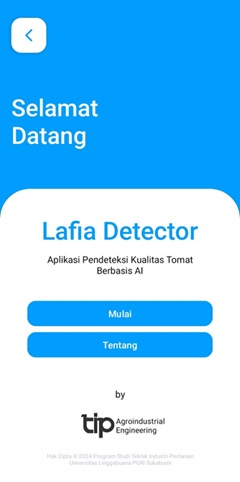
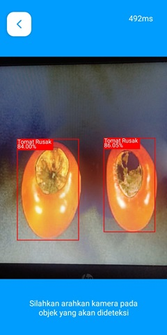
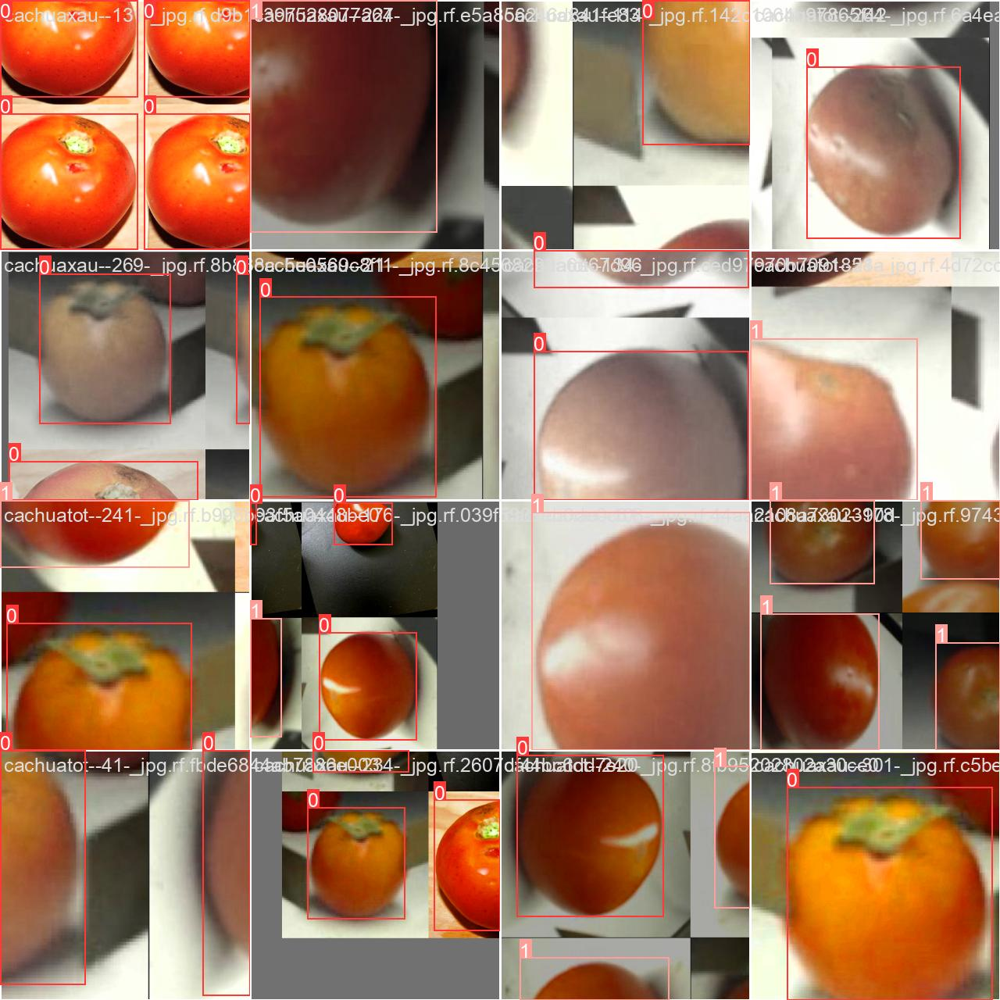
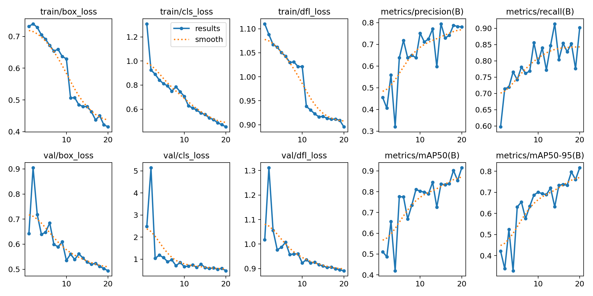
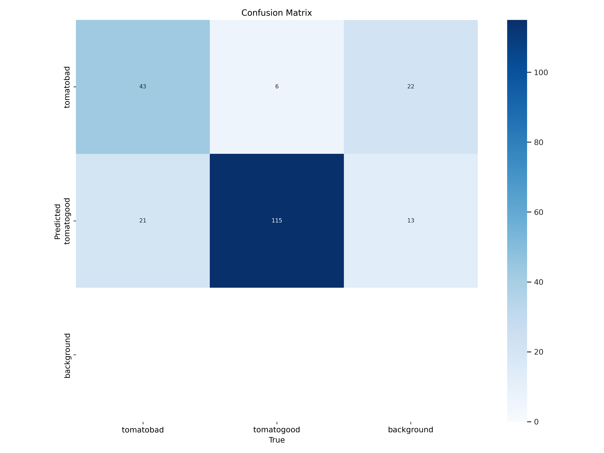
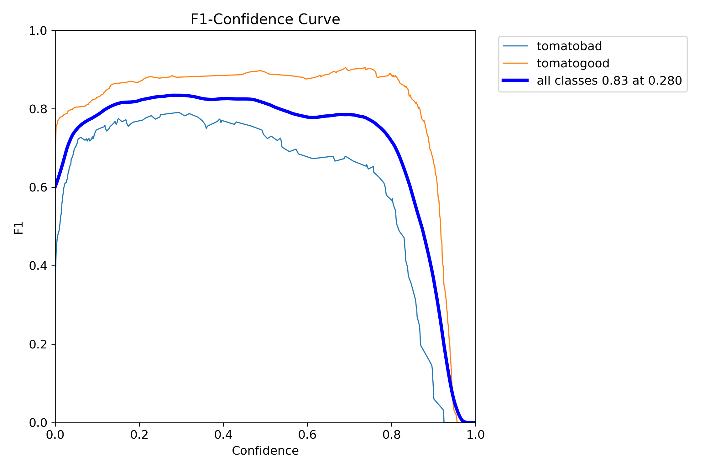

## Lafia Project

    
    

# Lafia Detector

This is an Android application that detects the defects of tomatoes using a deep learning model and computer vision. The model is based on transfer learning with YOLOv8 and has been trained on a custom dataset from Roboflow.

## Download

The application can be downloaded from the following link:

[Download Lafia Detector APK](https://drive.google.com/file/d/1XTaKibZQVaXQsfYLlI8x4MWIeA6F8Spf/view?usp=sharing)

## Features

- Detects the defects of tomatoes in real-time using the camera.
- Provides a defect score to help users make informed decisions.
- Easy-to-use interface with clear instructions.

## Dataset

The dataset was obtained from Roboflow and consists of 2452 images with 2 classes. The dataset can be accessed from the following link:

[Roboflow Dataset](https://universe.roboflow.com/hanoi-university-of-industry-xfhdu/tomato-frsnq)

## Model Training

The model was trained using transfer learning with YOLOv8 on a custom dataset from Roboflow. Once trained, the custom YOLOv8 model was converted to TensorFlow Lite for deployment on Android.

## Result

    
 "train_batch0" refers to the first batch of training data used in the training phase of a machine learning or deep learning model. It contains the initial subset of the training data, which the model processes to begin updating its parameters and improving performance.

    
 "val_batch0" refers to the first batch of validation data used during the validation phase of a machine learning or deep learning model. This batch is used to evaluate the model's performance and generalization ability on unseen data after training on the training batches.

    
 "result" refers to the outcome or output produced after performing a specific operation or task. In the context of machine learning, it can refer to the predictions, performance metrics, or any final output generated by the model after processing the data.

    
 A confusion matrix is a table used to evaluate the performance of a classification model. It displays the counts of true positive, true negative, false positive, and false negative predictions, helping to understand the model's accuracy, precision, recall, and overall performance.

    
 An F1 curve is a graphical representation that shows the F1 score of a classification model across different threshold values. The F1 score is the harmonic mean of precision and recall, and the curve helps in visualizing how the balance between precision and recall changes with varying thresholds.

    
    
  

## License

This project is licensed under the MIT License - see the [LICENSE](LICENSE) file for details.

## Acknowledgements

- [YOLOv8](https://github.com/ultralytics/ultralytics) for the object detection framework.
- [Roboflow](https://roboflow.com/) for the custom dataset and tools.
- The contributors who made this project possible.

## Contact

Creator
    
 Tresna Ayu Safitri

Program Studi Teknik Industri Pertanian Universitas Linggabuana PGRI Sukabumi

If you have any questions or suggestions, feel free to open an issue or contact us at [tresnaayu979@gmail.com](mailto:your-email@tresnaayu979@gmail.com).

